# Wishlify

Wishlify és una aplicació Android dissenyada per facilitar la gestió de llistes de regals i la coordinació entre usuaris, evitant duplicats i mantenint el factor sorpresa.

L’aplicació permet crear llistes personals, compartir-les amb altres usuaris amb permisos diferenciats i organitzar esdeveniments de tipus *Amic Invisible (Secret Santa)* de manera senzilla.

<!-- TOC -->
* [Wishlify](#wishlify)
  * [Features](#features)
  * [Arquitectura](#arquitectura)
  * [Tech Stack](#tech-stack)
  * [Captures](#captures)
    * [Wishlists](#wishlists)
    * [Wishlists compartides](#wishlists-compartides)
    * [Amic invisible](#amic-invisible)
  * [Deep Links](#deep-links)
  * [Notificacions](#notificacions)
  * [Estat del projecte](#estat-del-projecte)
  * [Setup i compilació](#setup-i-compilació)
    * [Requisits](#requisits)
    * [Passos](#passos)
  * [Configuració Firebase](#configuració-firebase)
  * [Testing](#testing)
<!-- TOC -->

---

## Features

- Creació i gestió de wishlists privades
- Wishlists compartides amb permisos asimètrics
- Sistema de reserva i compra d’ítems
- Xat en temps real per wishlist compartida
- Esdeveniments d’Amic Invisible (Secret Santa)
- Notificacions push (xat, recordatoris, actualitzacions)
- Deep links per compartir contingut
- Sistema de categories personalitzades

---

## Arquitectura

El projecte segueix una arquitectura moderna basada en:

- Clean Architecture
    - `data`
    - `domain`
    - `presentation`
- MVVM
- Jetpack Compose (UI declarativa)
- Kotlin Coroutines + Flow
- Injecció de dependències amb Koin

---

## Tech Stack

- Kotlin
- Jetpack Compose
- Firebase:
    - Authentication
    - Firestore
    - Cloud Functions
    - Firebase Cloud Messaging (FCM)
- Koin
- Coroutines / Flow

---

## Captures

### Wishlists


| Wishlists                                                 | Detall Wishlist                                                 | Detall ítem                                                          |
|-----------------------------------------------------------|-----------------------------------------------------------------|----------------------------------------------------------------------|
| 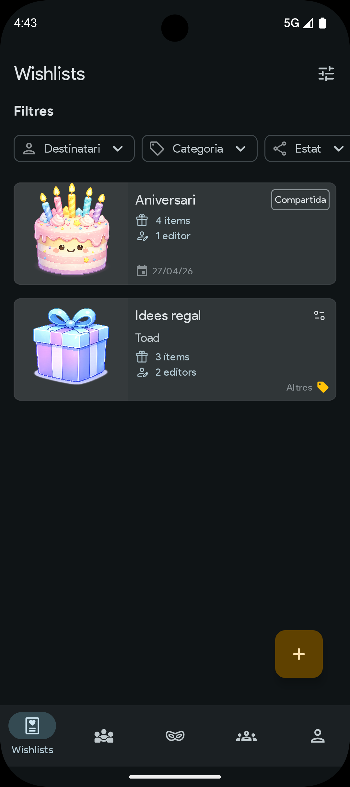 | 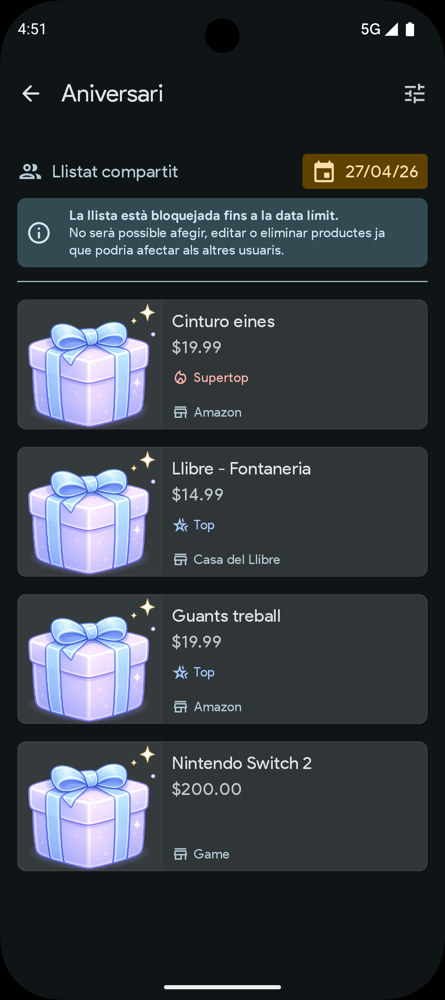 | 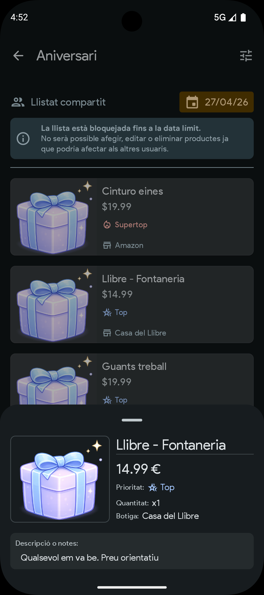 |

| Compartir wishlist                                                  |
|---------------------------------------------------------------------|
| 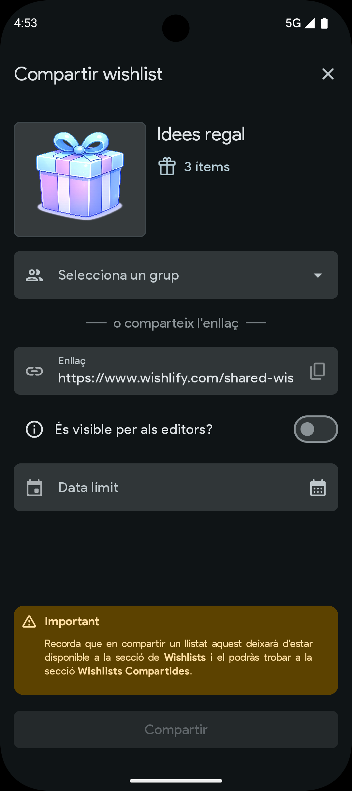 |

### Wishlists compartides

| Wishlists compartides                                            | Detall Wishlist compartida                                             | Detall ítem                                                                 |
|------------------------------------------------------------------|------------------------------------------------------------------------|-----------------------------------------------------------------------------|
| 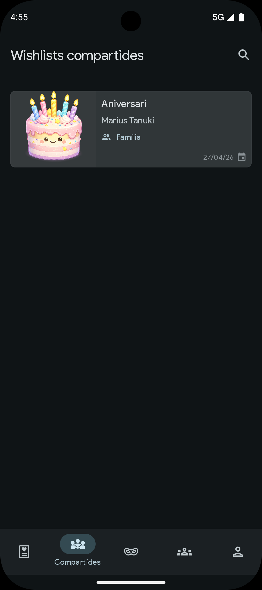 | 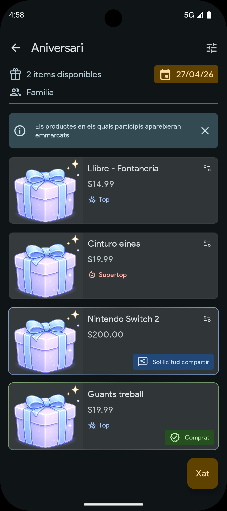 | 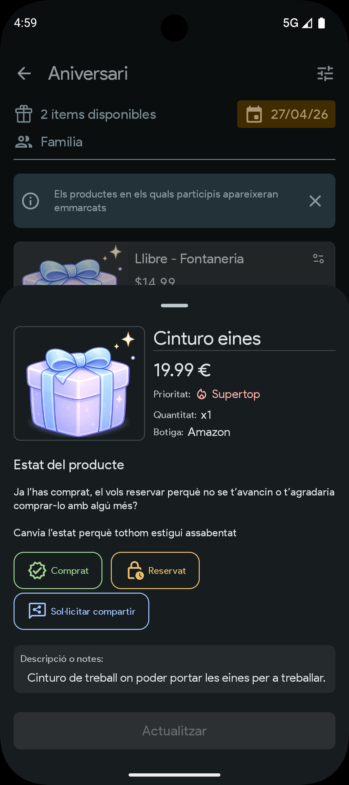 |

| Xat compartir wishlist                                               |
|----------------------------------------------------------------------|
| 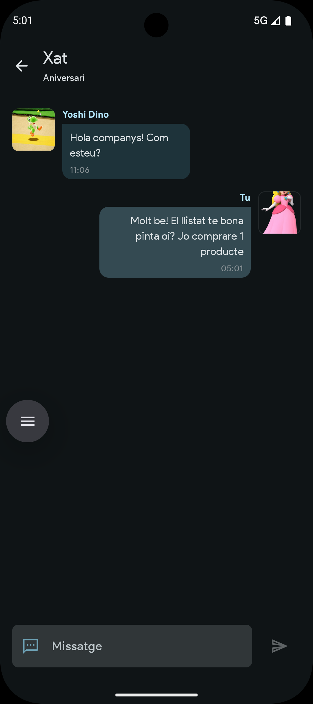 |

### Amic invisible

| Esdeveniments amic invisible                                        | Detall Amic invisible                                               | Creació d'exclusions                                                    |
|---------------------------------------------------------------------|---------------------------------------------------------------------|-------------------------------------------------------------------------|
| 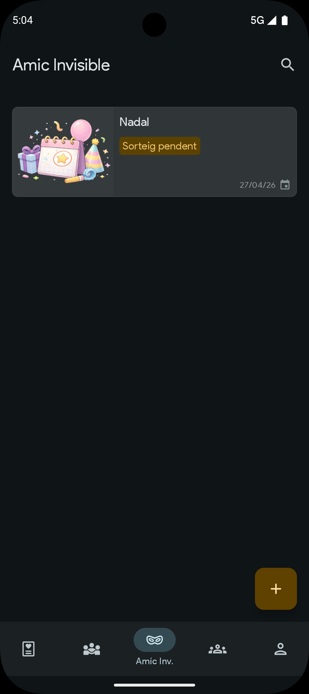 | 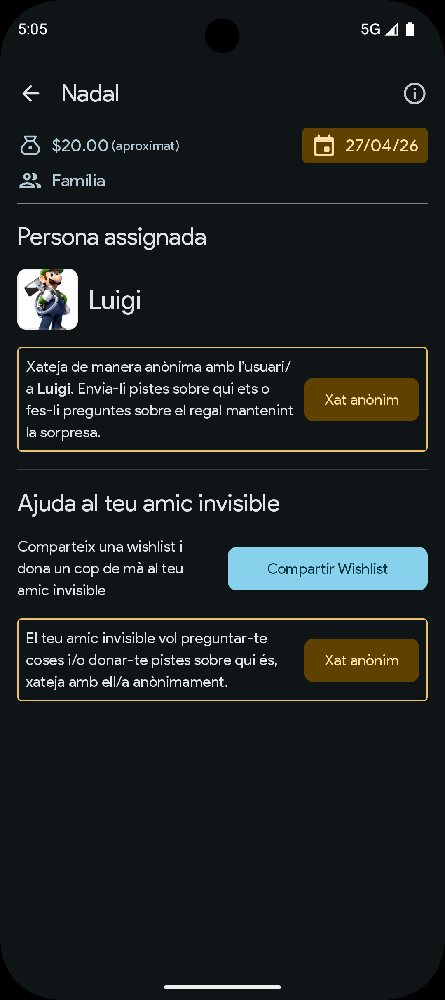 | 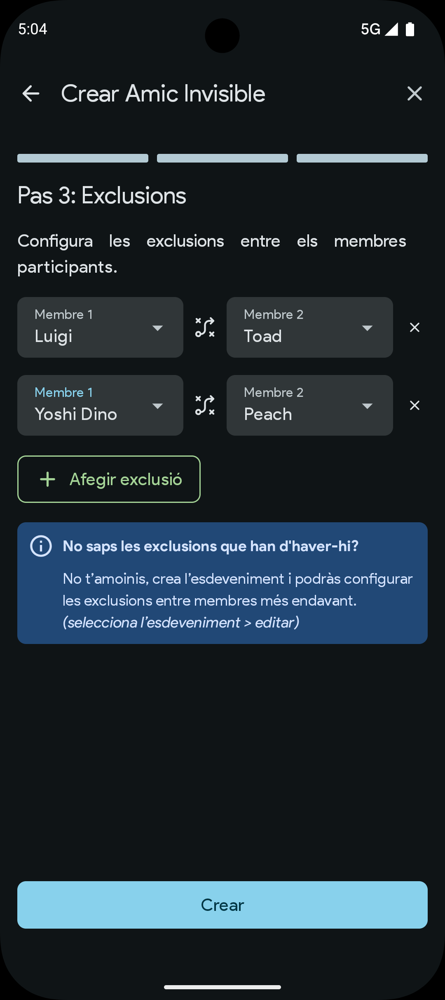 |

| Xats anònims                                                      |
|-------------------------------------------------------------------|
| 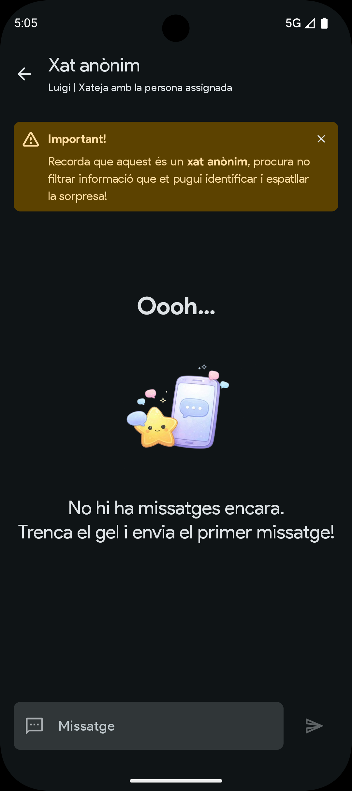 |

---

## Deep Links

L’aplicació suporta navegació mitjançant deep links:

- `/shared-wishlist/{id}`
- `/shared-wishlist/{id}/chat`
- `/secret-santa/{id}`
- `/secret-santa/{id}/chat`

Aquests enllaços permeten obrir directament seccions específiques de l’app des de notificacions o enllaços externs.

---

## Notificacions

S’implementen notificacions push per a:

- Nous missatges als xats
- Recordatoris d’esdeveniments a punt de finalitzar
- Actualitzacions d’estat en wishlists compartides

Les notificacions inclouen navegació directa mitjançant deep links.

---

## Estat del projecte

- MVP funcional completat
- Funcionalitats principals implementades
- Millores d’experiència d’usuari pendents
- Possibles ampliacions futures (IA, gamificació)

---

## Setup i compilació

### Requisits

- Android Studio
- SDK d’Android actualitzat
- Compte de Firebase

### Passos

1. Clonar el repositori:
   ```bash
   git clone https://github.com/splanes-dev/Wishlify.git
   ```
2. Obrir el projecte a Android Studio
3. Afegir el fitxer de configuració de Firebase:
    * Descarregar `google-services.json`
    * Col·locar-lo a `/app`
4. Executar l’aplicació en un emulador o dispositiu físic

---

## Configuració Firebase

El projecte requereix un projecte Firebase amb:

* Authentication habilitat (Email + Google)
* Firestore Database
* Cloud Functions
* Firebase Cloud Messaging (FCM)

---

## Testing

S’han realitzat:

* Tests unitaris per a la lògica de domini
* Validació manual end-to-end dels principals fluxos d’usuari:
    * Autenticació
    * Gestió de wishlists
    * Interacció en llistes compartides
    * Esdeveniments d’Amic Invisible
    * Gestió de grups
    * Perfil d'usuari
    * Notificacions push